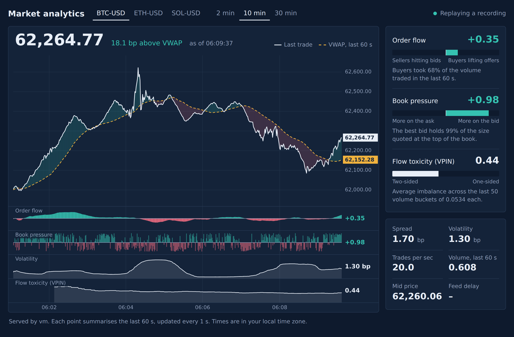

# pi-market-analytics

Streaming market analytics on a Raspberry Pi. A header-only C++17 core computes
rolling metrics; Python handles the data feed, recording, replay, a live web
dashboard, and a study of whether the metrics predict anything.

```
feed (Python, asyncio)  ->  AnalyticsEngine per product (C++ via pybind11)  ->  dashboard / console / CSV
  coinbase | synthetic | replay                                                 study.py (offline)
```



*Simulated data. Replace this with a screenshot of your own live session.*

## Metrics

All are computed over a rolling time window (default 60 s), O(1) per event.

| Field | Meaning |
|---|---|
| `vwap`, `volume` | volume-weighted average price and traded size in the window |
| `trade_imbalance` (order flow) | signed aggressor volume / total volume, -1 (all selling) to +1 (all buying) |
| `quote_imbalance` (book pressure) | (bid size - ask size) / (bid size + ask size) at the top of book |
| `volatility` | standard deviation of trade-to-trade log returns in the window |
| `mid`, `spread_bps` | top-of-book midpoint and spread in basis points |
| `trade_rate` | trades per second |
| `vpin` | flow toxicity, 0 (two-sided) to 1 (one-sided), averaged over the last 50 equal-volume buckets |

VPIN buckets are sized automatically: after the first full window of trading,
the bucket is set to a tenth of that window's volume. Pass `--vpin-bucket` to
fix it yourself. It uses the exchange-reported aggressor side rather than the
bulk-volume classification from the original paper.

## Setup (Raspberry Pi OS / Debian / Ubuntu)

```bash
sudo apt install -y build-essential cmake python3-dev python3-venv
python3 -m venv .venv && source .venv/bin/activate
pip install -r requirements.txt

cmake -S . -B build -Dpybind11_DIR=$(python3 -m pybind11 --cmakedir)
cmake --build build -j
ctest --test-dir build --output-on-failure
```

The build drops `pma_core.*.so` into `python/`.

## Dashboard

```bash
# simulated market, no network needed
python python/dashboard.py --source synthetic --products BTC-USD ETH-USD

# live Coinbase data (public feed, no API key), recording raw events as it goes
python python/dashboard.py --source coinbase --products BTC-USD ETH-USD SOL-USD --record data/session.csv

# replay a recording at 5x
python python/dashboard.py --source replay --file data/session.csv --speed 5
```

It prints the address to open, usually `http://raspberrypi.local:8080`. Any
phone or laptop on the same network can view it. Hover (or touch) the chart to
read every metric at that moment; the side panel follows.

The page has no login and listens on your whole local network. It is
read-only, but do not forward the port to the internet.

## Console

```bash
python python/run.py --source coinbase --products BTC-USD --record data/btc.csv
python python/run.py --source replay --file data/btc.csv --out data/btc_metrics.csv --quiet
```

Snapshots are emitted on event time, so replaying a recording gives identical
output every run.

## Signal study

Record a session, then ask whether the metrics lined up with what the price
did next:

```bash
python python/study.py data/session.csv --horizons 1 5 10 30 --csv data/features.csv
```

It reports, per product and look-ahead horizon, the correlation (IC), a rough
t-statistic, hit rate, and top-minus-bottom-quintile outcome for:

- order flow and book pressure against the signed forward return, and
- VPIN and volatility against the size of the forward move.

You can check the study itself with the simulator, which plants a known
flow-to-price effect:

```bash
python python/run.py --source synthetic --fast --max-events 288000 --quiet --record data/synth.csv
python python/study.py data/synth.csv      # should find a strong effect
```

With `impact=0` in `feeds.synthetic` (a pure random walk) it should find none.

## Benchmark

```bash
./build/pma_bench                  # peak throughput, unthrottled
./build/pma_bench 500000 50000     # latency at 50k msgs/sec
```

The benchmark uses two busy-spinning threads, so it needs two free cores to
give meaningful latency numbers. On the Pi, pin them:
`taskset -c 2,3 ./build/pma_bench`.

## Layout

```
cpp/include/pma/types.hpp        Trade, Quote, Snapshot
cpp/include/pma/analytics.hpp    AnalyticsEngine (rolling metrics, circular window buffer)
cpp/include/pma/vpin.hpp         volume-bucketed flow toxicity
cpp/include/pma/ring_buffer.hpp  lock-free SPSC queue
cpp/src/bindings.cpp             pybind11 module `pma_core`
cpp/tests/test_core.cpp          unit tests
cpp/bench/bench.cpp              throughput / latency benchmark
python/feeds.py                  coinbase, synthetic, replay sources
python/pipeline.py               per-product engines, snapshot timing, recording
python/dashboard.py              web server + WebSocket push
python/static/index.html         the dashboard page (no build step, no JS dependencies)
python/run.py                    console runner
python/study.py                  signal study
```

## Next steps

- A limit order book in C++ fed by Coinbase `level2` (needs an API key), for
  depth beyond the top quote.
- Move the feed handler into C++ (Boost.Beast + simdjson) and hand events to
  the engine through `SpscRingBuffer`.
- Rolling correlation between products.
- Run the dashboard as a systemd service so it starts with the Pi.
